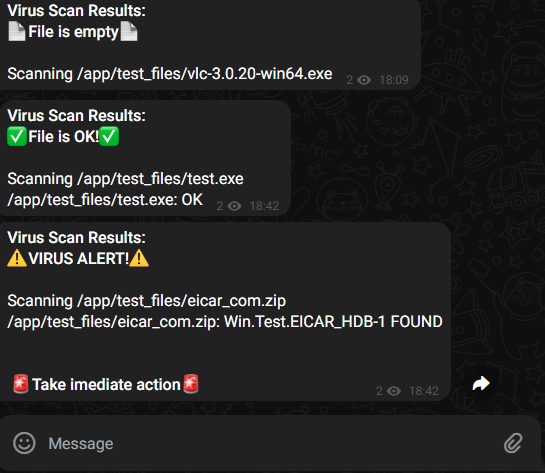

Ansible Magnum Opus
===================
Projectopdracht Oscar Alexander

Inleiding
---------
Deze Magnum Opus voor het vak 'Infrastructure As Code' heeft de bedoeling om een volledig functioneel, cloud-ready open-surce solution op Rocky Linux 9 te bouwen. Deze rol zorgt voor gemakkelijke deployment over verschillende IAAS cloud providers of VM enviorments. 

Idea
----
Mijn eerste idee, gebouwde op een al in development project was om een soort van malware sandbox proberen te implementeren. Dit idee was snel omgevormd naar wat het nu is geworden: Een virus scanning systeem.

Ik maak gebruik van open-source software, en eigen devlopment om een VM op te zetten met een volldig werkende malware scanner, je moet simpleweg de scanner via de web pagina benaderen en de file uploaden. Als de file is gescant krijg je een melding via telegram op je gsm terug van wat het resultaat is.



Requirments
-----------
- Operating System: Rocky Linux 9 met de meest recente updates.
- Ansible: Versie 2.10 of hoger.
- Git geinstalleerd
- Internet toegang
- Telegram account met een bot api key
- SSH toegang tot een IAAS cloud providere of VM.
- Basis begrip van Ansible en YAML syntax.

Used software
-------------
Ik licht hier kort de belangrijkste software componenten toe:
- Clamav - Virus scanning software
- Docker - Containerization
- Docker Compose 
- Ansible - Deployment
- Semaphore - UI for Ansible
- Python - Website run time enviorment
- Flask - Website hosting

Supported Systems
-----------------
- Rocky Linux 9
- CentOS 7
- Ubuntu Jimmy Server

Roles
-----
In de [/ansible/roles/](https://github.com/canuski/IAC-Cloud-Project/tree/main/ansible/roles) vind je alle roles terug die ik gebruik. Hieronder licht ik alle roles toe.

### Role 'packages_install' 
[main.yml](https://github.com/canuski/IAC-Cloud-Project/blob/main/ansible/roles/packages_install/tasks/main.yml)
Deze rol heb ik geschreven om te zorgen dat alle noodzakelijke software packages geinstalleerd zijn, de installatie wijze verschilt van OS to OS, ik foucus nu op diegene voor Rocky Linux 9. 

Ik begin met het updaten van alle packages naar de meest recente versie. Dan installeer ik de EPEL package voor Rocky Linux. Dan installeer ik Git, zodat ik de repoistories kan clonen. Dan installeer ik pip3, een handig tool om packages te installeren. Dan installeer ik 3 pacakges die ik nodig heb voor het opzetten van de website, en het sturen van telegram berichten.

### Role 'set_hostname'
[main.yml](https://github.com/canuski/IAC-Cloud-Project/blob/main/ansible/roles/set_hostname/tasks/main.yml)
Zet simpleweg de hostname op een geconfigueerde variablen.

### Role 'clamav_setup'
[main.yml](https://github.com/canuski/IAC-Cloud-Project/blob/main/ansible/roles/clamav_setup/tasks/main.yml) 
Deze rol installeerd en zet de clamav configuratie op.

Ik begin met het opnieuwe instaleren van de EPEL packages, voor het geval dat er iets is mis gegaan. Daarna installeer ik Clamav, clamd (daemon) en clamav-update (freshclam). Dan pas ik de configuratie file van Clamav aan zodat er geen voorbeeld systeem opstart. Daarna zet ik de localsocket aan. Dan upadate ik de Clamav database met het ```freashclam``` commando. Daarna start ik de clamav service. Ik run 3 commands om de rechten aan te passen van bepaalde files, dit is belangrijk voor clamav. Ten laatste voeg ik een cronjob toe voor het updaten van de database.

#### Role 'docker_setup'
[main.yml](https://github.com/canuski/IAC-Cloud-Project/blob/main/ansible/roles/docker_setup/tasks/main.yml)
Deze rol instaleerd en zet docker op.

Ik begin met het toevoegen van de docker ce repository. Daarna instaleer ik docker ce, docker cli en containerd.io. Dan start ik en anable ik de docker service. Ik installeer ten laatste de docker compose plugin.

Usage
-------
1. Zeker de bovenstaande requirments voldoen.
2. Clone deze repo naar de host machine ```git clone https://github.com/canuski/IAC-Cloud-Project.git```
3. Pas de variabelen aan, let vooral op de api key van de telegram bot, en de chat id toe te voegen in de .env file.
4. Voeg het ip van de target in de hosts file
5. Speel het ansible playbook af met ```ansible-playbook -i playbooks/hosts playbooks/playbook.yml```

Uitleg

Documentation
---------------
- [Design doc](https://github.com/canuski/Cloud-Sandbox/blob/main/Documents/DesignDoc.md)
- [Virus test](https://github.com/canuski/Cloud-Sandbox/blob/main/Documents/virus.md)
- [Performace test](https://github.com/canuski/Cloud-Sandbox/blob/main/Documents/performace.md)
